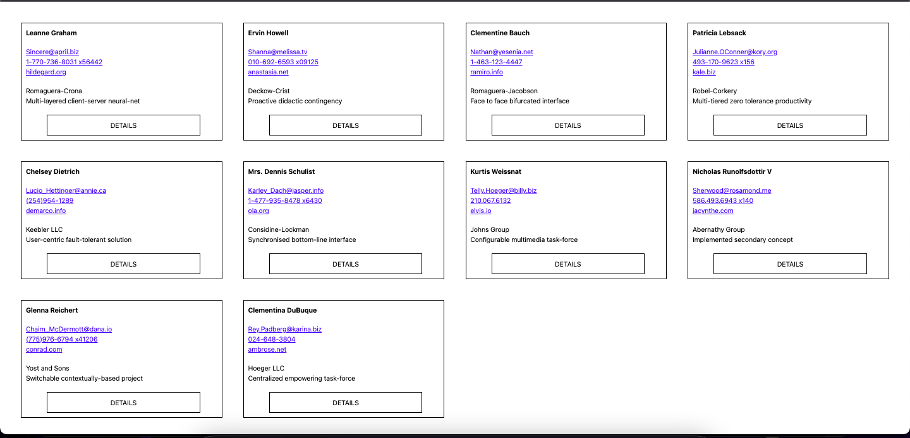
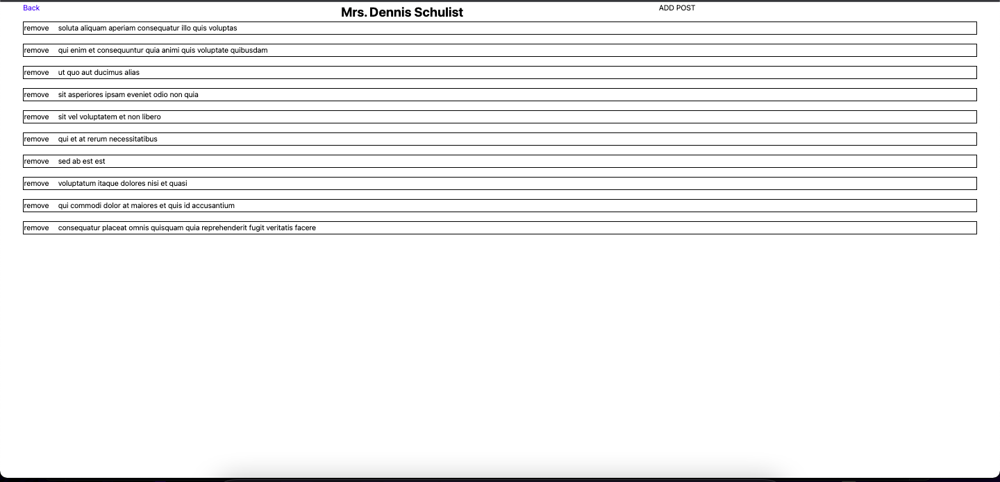
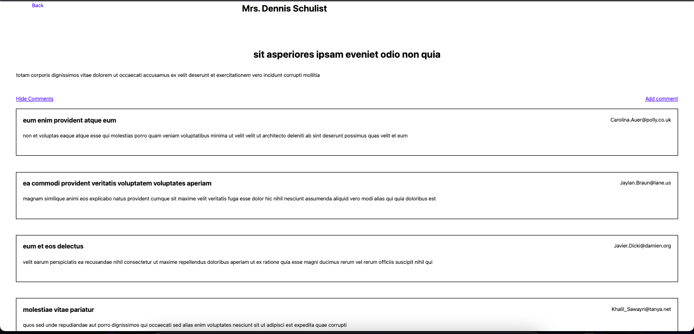
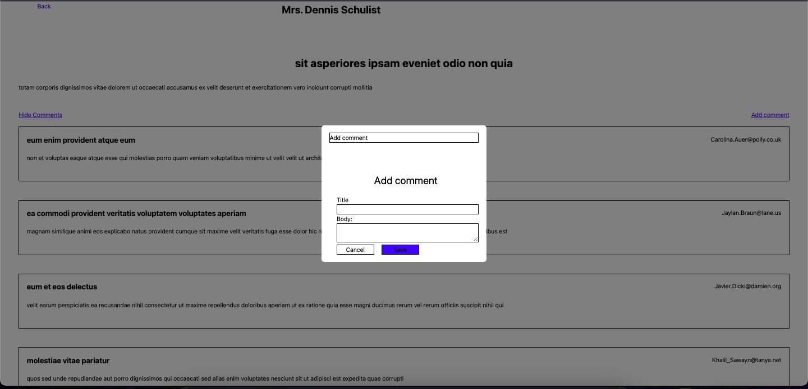

<p align="center">
  <a href="https://github.com/lucky-lore/nextjs-ts-rtl-jest-prettier-boilerplate">
    
  </a>

  <h1 align="center">NextJS, Typescript, Apollo, Eslint, Prettier Boilerplate</h1>

  ## Preview


#  Simple menagment application to administrate posts and comments.

I used Apollo GraphQl to fetch date from endpoint and then display them on front-end. 
Date are mutuable - you can easily add or remove items. 


## Main Features:

- Consumes [TMDB](https://graphqlzero.almansi.me/api) APIs
- Add or Remove post or comments
- Hide comments


### Tech Stack:
- [React JS](https://reactjs.org/docs/getting-started.html) v17.02 Bootstrapped with [Create React App](https://github.com/facebook/create-react-app).
- [Typescript](https://www.typescriptlang.org/)
- [NEXT JS ](https://nextjs.org/)
- [Apollo](https://www.apollographql.com)

### Instructions:
#### 1. Clone this repository.
```bash
git clone https://github.com/effectiveone/MovieApp-redux-toolkit.git
```

#### 2. Go to the project directory.
```bash
cd react-redux-toolkit-movie-app
```
#### 3. Install dependencies
You will need to install the dependencies listed in the package.json
```
npm install
```
or
```
yarn install
```
#### 3. Setup Account with TMDB & ALAN
Go here [TMDB](https://www.themoviedb.org/signup?language=en-US) to set up a account then you will need to request a API KEY.


#### 4. Set Environment Variables
You'll need to set your TMDB API key in the environment variable file so your project runs correctly. Rename `.example.env` file to `.env` and place your TMDB API key there. Be sure to remove the '#' sign prepending the variable names.

#### 5. Run The App
To start the app 
```
npm start
```
or
```
yarn start
```

## Screenshots




## 👨‍💻 Connect with me 
mail: konrad.gruca90@gmail.com
